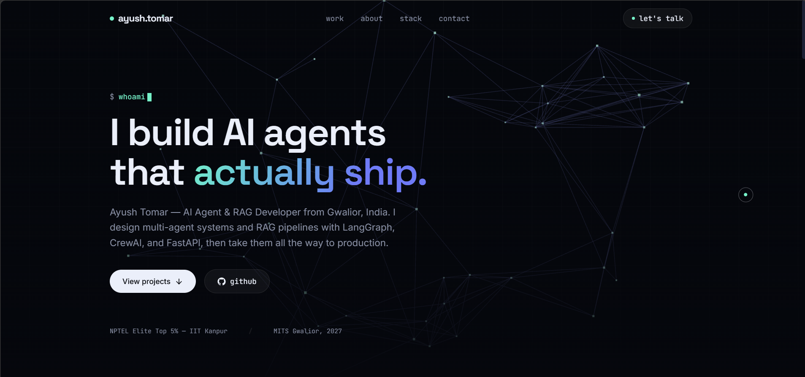

# Ayush Tomar — Portfolio

[](https://ayush-s-tomar.vercel.app)
[](https://vitejs.dev)
[](https://react.dev)
[](#license)

### [→ ayush-s-tomar.vercel.app](https://ayush-s-tomar.vercel.app)

A dark, glassmorphic portfolio with a live Three.js agent-graph hero, glowing project cards, and scroll-triggered motion — built to show shipped AI/agent work, not just a demo.

Most portfolios list projects. This one is meant to work like a pitch: the hero states the positioning in one line, the agent-graph background reinforces "AI agents" visually instead of just in text, and every project card links straight to a live deployment — so a recruiter or client can verify shipped work in seconds, not take my word for it.



## Contents
- [Stack](#stack)
- [Run locally](#run-locally)
- [Build for production](#build-for-production)
- [Deploy](#deploy-free--vercel)
- [Customize](#customize)
- [Notes](#notes)
- [License](#license)

## Stack

| Layer | Tech |
|---|---|
| Frontend | React, Vite, Tailwind CSS v4 |
| Motion | Framer Motion, Three.js (animated agent-graph background) |
| Deploy | Vercel |

## Run locally

```bash
npm install
npm run dev
```

Opens at `http://localhost:5173`.

## Build for production

```bash
npm run build
npm run preview
```

Output goes to `dist/`.

## Deploy (free — Vercel)

1. Push this repo to GitHub.
2. On [vercel.com](https://vercel.com) → **New Project** → import the repo.
3. Framework preset: **Vite** · Build command: `npm run build` · Output dir: `dist`.
4. Deploy.

Netlify works the same way — build command `npm run build`, publish dir `dist`.

## Customize

| File | What it controls |
|---|---|
| `src/data.js` | All project content, stack tags, metrics — edit this first |
| `src/components/Hero.jsx` | Headline, subtext, stats line |
| `src/components/Contact.jsx` | Email, testimonial, availability line |
| `src/index.css` | Color tokens at the top — controls the whole palette |
| `src/components/AgentGraph.jsx` | `NODE_COUNT` / `CONNECT_DIST` — hero graph density |

## Notes

- **Why Three.js for the hero:** a static hero image doesn't communicate "agent systems" the way a live, connected node graph does — the animation is the pitch, not decoration.
- **Performance:** node count and connection distance are tuned (see `AgentGraph.jsx`) to stay smooth on mid-range laptops; drop `NODE_COUNT` first if you notice frame drops on your machine.
- Respects `prefers-reduced-motion` for accessibility — the graph animation is disabled for users who request it.
- No backend — fully static, deploys as a single Vite build, so there's no cold-start latency on load.
- Update the `mailto:` address in `Contact.jsx` and demo links in `data.js` before reusing.

## License

All rights reserved. This repository is public for portfolio and review purposes only. The code, project write-ups, testimonial content, bio, and design may not be copied, redistributed, or reused without permission.

---

Built by [Ayush Tomar](https://github.com/ayush-s-tomar) · [LinkedIn](https://www.linkedin.com/in/ayushsinghtomar) · [Dev.to](https://dev.to/ayushsinghtomar)
